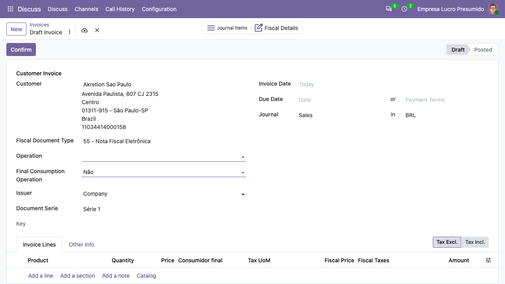
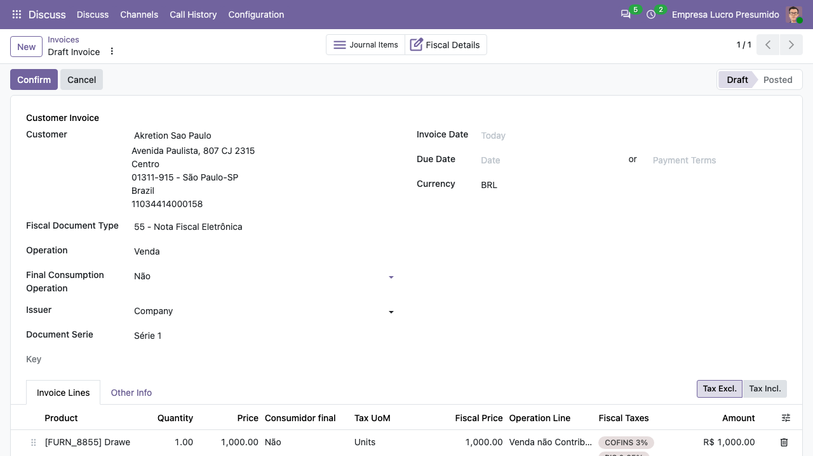
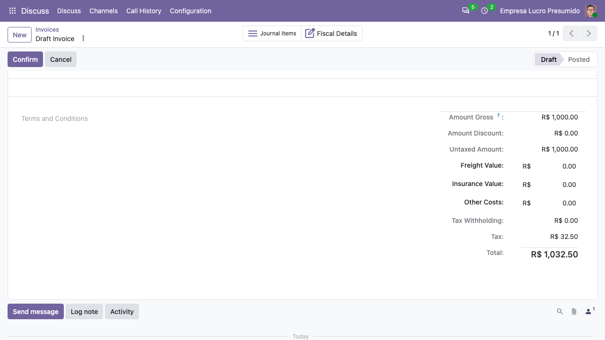

## Na tela (Odoo 20.0)

Em *Faturamento > Clientes > Faturas*, crie uma fatura numa empresa brasileira.

1. Escolha o cliente e o **Tipo de Documento Fiscal** (por exemplo
   `55 - Nota Fiscal Eletrônica`): aparecem a **Operação** fiscal, o consumidor
   final, o emissor e a série do documento.

   

2. Inclua as linhas: cada linha resolve a linha da operação fiscal e mostra os
   tributos fiscais (ICMS, IPI, PIS, COFINS, IBS, CBS) calculados pelo motor
   fiscal, que alimentam os impostos contábeis da fatura.

   

3. Os totais mostram o valor bruto, o desconto, frete, seguro e outros custos,
   as retenções e o total com os impostos por fora (como o IPI).

   

O botão **Fiscal Details** abre o documento fiscal ligado à fatura.

## Passo a Passo: Criando uma Fatura Fiscal

O processo se inicia a partir da fatura padrão do Odoo, agora "decorada" com os campos fiscais necessários.

1.  **Navegue até Faturamento**
    Acesse o menu `Faturamento > Clientes > Faturas`.

2.  **Crie uma Nova Fatura**
    Clique no botão `Criar`.

3.  **Selecione o Cliente**
    No campo `Cliente`, selecione um parceiro configurado para o Brasil. O cadastro do cliente contenha as informações fiscais corretas (CNPJ/CPF, perfil fiscal, endereço, etc.). Nos dados de demonstração, a **AMD do Brasil** é um excelente exemplo.

4.  **Preencha os Dados Fiscais do Cabeçalho**
    Com a instalação do módulo, novos campos fiscais aparecerão no cabeçalho da fatura.
    *   **Tipo de Documento**: Selecione o modelo do documento fiscal. Para uma NF-e, por exemplo, escolha **`55 - Nota Fiscal Eletrônica`**.
    *   **Operação Fiscal**: Este é um campo chave. Ele define a natureza da transação. Selecione uma operação compatível, como **`Venda de Mercadoria`**.

5.  **Adicione as Linhas da Fatura**
    Na aba `Linhas da Fatura`, clique em `Adicionar uma linha`.
    *   Selecione um produto. Usando os dados de demonstração, você pode escolher o produto **`[E-COM08] Storage Box`**.
    *   Observe que, ao selecionar o produto, os campos fiscais da linha, como `Operação Fiscal da Linha` e `Impostos`, são preenchidos automaticamente com base nas regras da Operação Fiscal principal. Os impostos são calculados e exibidos em tempo real.

## Visualizando e Editando os Detalhes Fiscais da Linha

A grade de linhas da fatura oferece uma visão simplificada. Para acessar todos os detalhes fiscais de uma linha ou para editar manualmente algum campo (como um NCM ou CST específico para aquela operação), você pode usar o modo de edição em pop-up.

*   Clique no ícone de **"abrir registro externo" (um quadrado com uma seta)**, localizado à esquerda da linha do produto na grade editável.
*   Uma janela pop-up se abrirá, exibindo o formulário completo da linha. Nele, você encontrará a aba **`Impostos`**, que contém o detalhamento completo dos cálculos para cada tributo (ICMS, IPI, PIS, COFINS, etc.).

## Verificando os Lançamentos Contábeis

Após preencher a fatura, você pode (e deve) inspecionar os lançamentos contábeis que serão gerados.

1.  Acesse a aba **`Lançamentos Contábeis`**.
2.  Nesta aba, você verá todas as contas que serão movimentadas, incluindo as linhas específicas para cada imposto (débito de impostos a recuperar, crédito de impostos a recolher, etc.), refletindo o resultado dos cálculos do motor fiscal.

> **Nota Importante**: Para usuários da versão Community do Odoo, a aba `Lançamentos Contábeis` pode estar oculta por padrão. A instalação do módulo **`account_usability`** (disponível no repositório `OCA/account-financial-tools`) é fortemente recomendada para torná-la visível e facilitar a análise contábil.

Após a conferência, você pode `Confirmar` a fatura para gerar os lançamentos contábeis e prosseguir com a transmissão do documento fiscal, caso seja um documento eletrônico.

## Acessando a Visão Fiscal Detalhada

No canto superior direito do formulário da fatura, você encontrará um *smart button* chamado **Detalhe Fiscal**.

Clicar neste botão permite navegar diretamente para a tela do `l10n_br_fiscal.document`, que oferece uma visão completa e focada nos aspectos puramente fiscais. Nesta tela, é possível consultar detalhes aprofundados, gerenciar o ciclo de vida do documento (cancelamento, carta de correção) e, para documentos eletrônicos, acompanhar todo o histórico de comunicação e o status de transmissão junto à SEFAZ.
